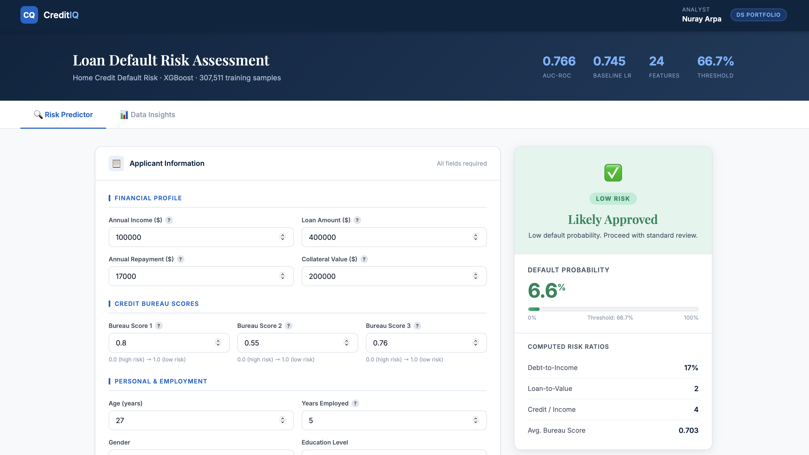
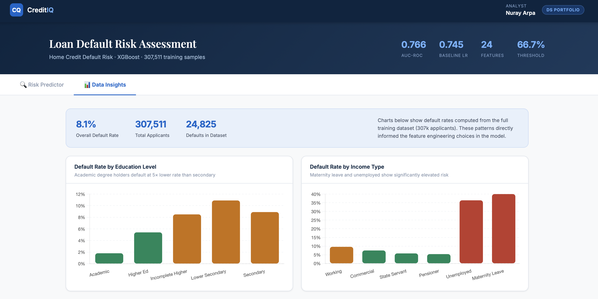

# 🏦 Mortgage Default Risk Predictor

> **Live Demo:** [mortgage-approval-predictor.onrender.com](https://mortgage-approval-predictor.onrender.com)  
> ⚠️ *Hosted on Render free tier — first load may take ~50 seconds to wake up*

A production-ready credit risk assessment tool that predicts the probability of loan default for individual applicants. Built on the [Home Credit Default Risk](https://www.kaggle.com/c/home-credit-default-risk) dataset (307k applications), the project combines XGBoost with domain-driven financial feature engineering and is deployed as a full-stack web application with a FastAPI backend and interactive frontend.

---

## 📸 Screenshots

### Risk Predictor


### Data Insights


---

## 📊 Model Performance

### Baseline vs Final Model

| Model | AUC-ROC | Notes |
|-------|---------|-------|
| Logistic Regression | 0.7449 | Scaled features, `class_weight='balanced'` |
| **XGBoost** | **0.7660** | 287 trees, early stopping, `scale_pos_weight` |

XGBoost was chosen over Logistic Regression because the relationship between features and default risk is non-linear — for example, DTI ratio peaks in the 20-30% bucket rather than at the highest values, which a linear model cannot capture effectively.

### Classification Report (optimal threshold = 0.667)

| Class | Precision | Recall | F1 |
|-------|-----------|--------|----|
| Non-default (0) | 0.95 | 0.90 | 0.92 |
| **Default (1)** | **0.26** | **0.41** | **0.32** |

> **Why 0.667 threshold?** The default 0.5 threshold gave only 18% precision on defaults. By tuning the threshold via Precision-Recall curve optimisation, we raised precision to 26% while maintaining 41% recall — a better trade-off for a credit risk context where false negatives (approving bad loans) are costly.

### Class Imbalance
The dataset is heavily imbalanced (92% non-default / 8% default). This was handled using XGBoost's `scale_pos_weight` parameter, which upweights the minority class during training. Evaluation was done using AUC-ROC rather than accuracy, as accuracy is misleading on imbalanced datasets.

---

## 🔧 Feature Engineering

**4 of the top 7 SHAP features were hand-engineered** from raw columns using financial domain knowledge — demonstrating that domain expertise directly improved model signal beyond what raw data could provide.

| Feature | Formula | SHAP Rank | Financial Meaning |
|---------|---------|-----------|-------------------|
| `EXT_SOURCE_MEAN` | Mean(Bureau1, Bureau2, Bureau3) | **#1 ⭐** | Composite creditworthiness score |
| `ANNUITY_TO_CREDIT` | Annuity / Credit Amount | **#2** | Monthly burden relative to loan size |
| `LTV_RATIO` | Credit / Goods Price | **#7** | Loan-to-value — collateral coverage |
| `DTI_RATIO` | Annuity / Annual Income | #15 | Debt-to-income — affordability |
| `CREDIT_TO_INCOME` | Credit / Income (capped 20x) | — | Leverage ratio |

### SHAP Feature Importance


> **Key finding:** `EXT_SOURCE_MEAN` — a simple average of three external bureau scores — dominates all other features by a large margin. This composite feature outperforms each individual bureau score, validating the aggregation approach.

---

## 📈 Data Insights

Analysis of default rates across 307k applicants revealed several patterns that informed feature selection:

| Segment | Default Rate | Insight |
|---------|-------------|---------|
| Academic degree | 1.8% | Education strongly predicts repayment |
| Lower secondary | 10.9% | 6× higher than academic |
| Unemployed | 36.4% | Highest risk income type |
| Maternity leave | 40.0% | Temporary income gap risk |
| Age 18-25 | 12.3% | Youth = higher risk |
| Age 55+ | 5.2% | Experience = lower risk |
| Male | 10.1% | vs Female 7.0% |
| Cash loans | 8.3% | vs Revolving 5.5% |

> **Interesting finding:** DTI ratio shows a non-linear relationship with default — risk peaks in the 20-30% bucket, not at the highest DTI values. This suggests that very high DTI applicants are already being filtered out upstream, or that other factors dominate at extreme DTI levels.

---

## 🏗️ Tech Stack

| Layer | Technology | Purpose |
|-------|-----------|---------|
| Model training | Python, XGBoost, scikit-learn | ML pipeline |
| Explainability | SHAP | Feature importance |
| Backend | FastAPI | REST API (`/api/predict`) |
| Frontend | HTML / CSS / Vanilla JS | Bank-style UI |
| Charts | Chart.js | Data insights tab |
| Deployment | Render.com | Full-stack hosting |
| Version control | GitHub | [`nurayarpa/mortgage-approval-predictor`](https://github.com/nurayarpa/mortgage-approval-predictor) |

---

## 📁 Project Structure

```
mortgage-approval-predictor/
├── api/
│   └── index.py            # FastAPI backend — /api/predict endpoint
├── model/
│   ├── mortgage_model.pkl  # Trained XGBoost model (287 estimators)
│   ├── imputer.pkl         # Median imputer for missing values
│   ├── feature_cols.json   # Feature column order (29 features)
│   └── cat_mappings.json   # Label encoder category mappings
├── public/
│   └── index.html          # Full frontend — predictor + data insights tabs
├── screenshots/
│   ├── predictor.png       # App screenshot — risk predictor tab
│   ├── insights.png        # App screenshot — data insights tab
│   └── shap.png            # SHAP feature importance plot
├── requirements.txt
└── README.md
```

---

## 🚀 Run Locally

```bash
git clone https://github.com/nurayarpa/mortgage-approval-predictor.git
cd mortgage-approval-predictor
pip install -r requirements.txt
uvicorn api.index:app --reload
# Open http://localhost:8000
```

---

## 🔄 Next Improvements

- [ ] Add SHAP waterfall plot for individual predictions in the UI
- [ ] Incorporate `bureau.csv` aggregations for estimated +0.01–0.02 AUC lift
- [ ] Add Airflow pipeline for automated retraining

---

## 👤 Author

**Nuray Arpa**
* 📧 nuray.m.arpa@gmail.com
* 💼 [LinkedIn](https://linkedin.com/in/nurayarpa)
* 🐙 [GitHub](https://github.com/nurayarpa)